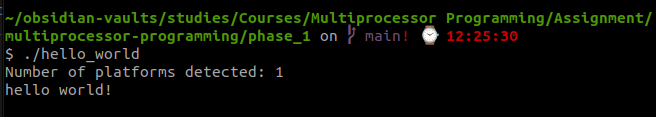

# Phase 1 - OpenCL setup and "Hello World"

## Summary of goals
A working development environment, knowledge of the open CL basics.

## Setting up OpenCL development environment
My PC is a Dell laptop with an Nvidia Quadro P600 Mobile GPU, so CUDA toolkit is needed to be able to compile and run OpenCL code.

## Installing CUDA toolkit
1. Download the toolkit installer from [Nvidia website](https://developer.nvidia.com/cuda-toolkit-archive).
2. Run the installer (as root), select only Toolkit in the menu.
3. Add the install directories to PATH and LD_LIBRARY_PATH variables

At the time of installation, the latest CUDA version was 12.3.

I also needed to install an updated Nvidia driver.

## Configuring the paths also in VS Code
VS Code needs to know where to find OpenCL headers and libraries, so the following paths need to be added to `includePath` field in `c_cpp_properties.json` configuration file:
- `/usr/local/cuda-<version>/include/`
- `/usr/local/cuda-<version>/lib64/`

VSCode needs to link the compiled object file with OpenCL library, so `-lOpenCL` argument should be added.

The paths also need to be added to the build task, which for ends up looking like this:
```jsonc
{
	"version": "2.0.0",
	"tasks": [
		{
			"type": "cppbuild",
			"label": "C/C++: clang build active file",
			"command": "/usr/bin/clang",
			"args": [
				"-fcolor-diagnostics",
				"-fansi-escape-codes",
				"-I",
				"/usr/local/cuda-12.3/include/",
				"-L",
				"/usr/local/cuda-12.3/lib64/",
				"-lOpenCL",
				"-g",
				"${file}",
				"-o",
				"${fileDirname}/${fileBasenameNoExtension}"
			],
			"options": {
				"cwd": "${fileDirname}"
			},
			"problemMatcher": [
				"$gcc"
			],
			"group": {
				"kind": "build",
				"isDefault": true
			},
			"detail": "compiler: /usr/bin/clang"
		}
	]
}
```

## Building OpenCL "hello world"
The code can be found in [hello_world.c](./hello_world.c).

Compilation and linking steps succeed in VSCode after setting the environment variables and compiler flags as stated above.

```console
 *  Executing task: C/C++: clang build active file 

Starting build...
/usr/bin/clang -fcolor-diagnostics -fansi-escape-codes -I /usr/local/cuda-12.3/include/ -L /usr/local/cuda-12.3/lib64/ -lOpenCL -g "/home/lassi/obsidian-vaults/studies/Courses/Multiprocessor Programming/Assignment/multiprocessor-programming/phase_1/hello_world.c" -o "/home/lassi/obsidian-vaults/studies/Courses/Multiprocessor Programming/Assignment/multiprocessor-programming/phase_1/hello_world"

Build finished successfully.
```

## Running OpenCL "hello world"



[< Back to top](../README.md)
