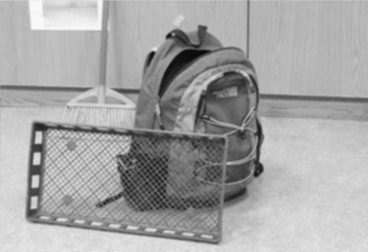

# Phase 2 - OpenCL introduction

## Summary of goals
A simple set of routines working on OpenCL, with auxiliary functions.

Program(s) should be able to do:
- matrix addition
- grayscale conversion
- filtering

It should also be able to measure time taken by a subroutine.

It should also be able to use OpenCL profiling utilities.

## Matrix addition (and multiplication) with OpenCL
[exercise_1/main.c](./exercise_1/main.c) contains a C program which compiles the OpenCL kernels from [madd_float_kernel.cl](./exercise_1/madd_float_kernel.cl) and [mmul_float_kernel.cl](./exercise_1/mmul_float_kernel.cl), comparing their performance to plain C implementations of matrix addition and multiplication.

The program was heavily inspired by the [Hands On OpenCL Exercise 6](https://github.com/HandsOnOpenCL/Exercises-Solutions/blob/master/Solutions/Exercise06/README.md).

The [exercise_1 directory](./exercise_1/) also contains [mmul_main.c](./exercise_1/mmul_main.c) and [madd_main.c](./exercise_1/madd_main.c) as well as corresponding [mmul_int_kernel.cl](./exercise_1/mmul_int_kernel.cl) and [madd_int_kernel.cl](./exercise_1/madd_int_kernel.cl) which do matrix multiplication and addition with integers for a fixed 3x3, verifying the output is correct.

### Output
Using 100x100 matrices in the following case:
```console
$ ./main
Number of platforms detected: 1
comparing addition:
plain:  22623 ns
opencl: 26656 ns

comparing multiplication:
plain:  2310410 ns
opencl: 201632 ns

```

## Grayscale conversion, image resizing and filtering (in C)
[exercise_2/main.c](./exercise_2/main.c) contains a program which is able to downscale an image, convert an RGBA image to grayscale, and apply 5x5 smoothing filter on a grayscale image.

The program is pretty well structured and the image operations are implemented in [image_operations.c](./image_operations.c).

The program uses test images from [test_images](./test_images/).

The program can be built by running `make` in the `exercise_2` directory.

Example output:
```console
$ bin/main
loading image: ../test_images/im0.png
loaded image successfully!
w: 2940 h: 2016
scaling image by 0.25x
converting image to grayscale
applying filter to image
outputting image: output_images/output_0.png
profiling block "resizing" took 1880 µs
profiling block "grayscaling" took 1788 µs
profiling block "filtering" took 25933 µs
```

Note: compiler settings heavily affect the reported performance.
The above example was done using `-g -O0` flags.

The program transforms image [im0.png](./test_images/im0.png) into [output_0.png](./exercise_2/output_images/output_0.png):

Input:


Output:




## Grayscale conversion, image resizing and filtering (in OpenCL)

[< Back to top](../README.md)
