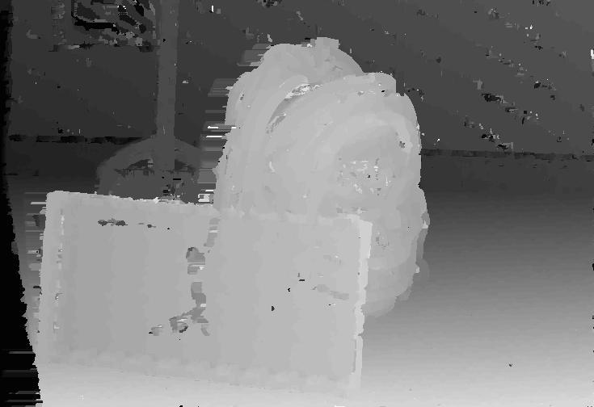

# Phase 3 - Stereo disparity implementation in single-threaded C code

## Summary of goals
A simple but correct serial implementation using C code.

## Implementation

Implementation is found in [main.c](./main.c).

ZNCC specific functions are implemented in [zncc_operations.c](./zncc_operations.c).

The execution is split into four parts:
1. image pre-processing:
   - converting large input RGBA images into smaller grayscale floating point images
2. data window pre-processing:
   - creating data-windows for each pixel
   - calculating mean and standard deviation of each window
   - zero-mean'ing and normalizing each window
3. computing depthmaps
   - left to right
   - right to left
4. cross-checking left-to-right and right-to-left depthmaps, filling zero regions


## Unit tests
Some unit tests are implemented in [test_main.c] using [µnit](https://github.com/nemequ/munit) unit testing library. 
Code coverage is measured using `gcov` and reported with `lcov`. 
These can be run by executing `make coverage`.

Line coverage details:
| File              | Line coverage (%) | Function coverage (%) |
| ----------------- | ----------------: | --------------------: |
| zncc_operations.c |              98.3 |                 100.0 |
| coord_fifo.c      |             100.0 |                 100.0 |

## Results
Performance of the program is quite good.

The execution time is around 4.26 seconds total.

Used compiler flags:
```
-g -O2
```

Measured on a `i7-8850H` CPU with reported 5200 bogomips, clocking up to 4100MHz.

There is some variance from one run to the next, as expected.

Pre-processed data windows take up most of the memory, as they require
```math
\begin{align}
\text{size} &= \text{image width} * \text{image height} * \text{window width} * \text{window height} * \text{sizeof(double)} \\
&= 735 * 504 * 9 * 9 * 8 \\
&= 240045120 \\
&\approx 240 \space \text{MB}
\end{align}
```

per image!

Real peak memory use is reported as just under 500 MB.

| Step               | Duration (ms) |
| ------------------ | ------------: |
| `preprocessing`    |           431 |
| `zncc_calculation` |          2925 |
| `postprocessing`   |           282 |

Output:
```console
$ /usr/bin/time -f "\n\nexecution time %e s\npeak memory use %M kB" bin/main
loading images...
pre-processing images...
pre-processing data windows...
computing depthmap left to right:
computing depthmap right to left:
cross-checking...
filling empty regions...
output crosschecked depthmap
profiling block "preprocessing" took 417.929 ms
profiling block "zncc_calculation" took 2.779 s
profiling block "postprocessing" took 228.263 ms
profiling block "total_runtime" took 3.759 s


execution time 3.76 s
peak memory use 496700 kB
```

## Output depthmap
Final depthmap looks like this:


The backpack and basket are clearly in the foreground.
The broom is also distinguished from the wall.

There are some artifacts still present, especially noticeable on the wall and near the borders.

Intermediate images such as window means, window standard deviations, and raw ZNCC data are also included in the `output_images` directory.

[< Back to top](../README.md)
