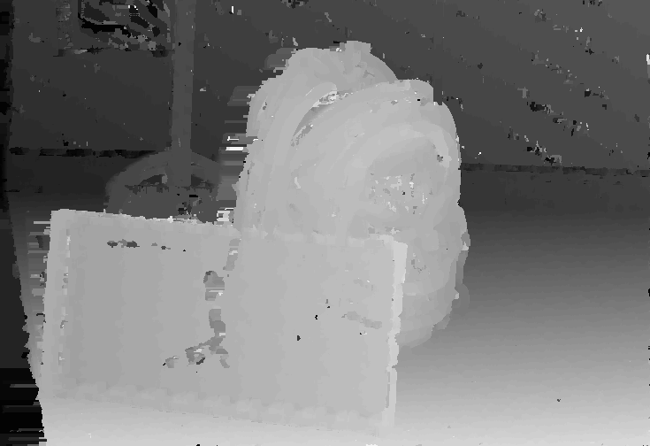

# Phase 4 - Stereo disparity implementation in multi-threaded C code with OpenMP

## Summary of goals
A C implementation that utilize more than one core of the CPU.

## Implementation
Implementation of the program is almost the same as in [phase_3](../phase_3/README.md).

Only difference is that some of the top-level for-loops have been parallelized with `#pragma omp parallel for`

Parallelized loops:
- extracting data windows
- calculating ZNCC data
  - left to right
  - right to left
- postprocessing
  - cross-checking
  - zero-value filling

Almost all loops could be parallelized simply by adding the `#pragma omp parallel for` statement.

The zero-value filling required some more through than the others due to how it uses pre-allocated memory for the BFS visited map and FIFO.
Here it was necessary to use the `#pragma omp parallel` statement, and manually use the thread number and total number of threads when accessing image rows.
Each thread allocated it's own data for BFS.

### Output

Example output from parallelized version:

```console
$ /usr/bin/time -f "\n\nexecution time %e s\npeak memory use %M kB" bin/main
loading images...
pre-processing images...
pre-processing data windows...
computing depthmap left to right:
computing depthmap right to left:
outputting raw depthmaps
cross-checking...
filling empty regions...
output crosschecked depthmap
profiling block "preprocessing" took 93.054 ms
profiling block "zncc_calculation" took 0.491 s
profiling block "postprocessing" took 68.267 ms
profiling block "total_runtime" took 1.405 s


execution time 1.40 s
peak memory use 502116 kB
```

Reference output from single-threaded version:
```console
$ /usr/bin/time -f "\n\nexecution time %e s\npeak memory use %M kB" bin/main
loading images...
pre-processing images...
pre-processing data windows...
computing depthmap left to right:
computing depthmap right to left:
cross-checking...
filling empty regions...
output crosschecked depthmap
profiling block "preprocessing" took 98.696 ms
profiling block "zncc_calculation" took 0.474 s
profiling block "postprocessing" took 52.856 ms
profiling block "total_runtime" took 0.975 s


execution time 0.98 s
peak memory use 501904 kB
CPU usage: 817%
```

> NOTE: both versions have progress printing disabled as it may impact execution time.

| Phase              | Execution time (single threaded) | Execution time (parallelized) | Speed up (ratio) |
| ------------------ | -------------------------------: | ----------------------------: | ---------------: |
| `preprocessing`    |                       417.929 ms |                     98.696 ms |             4.23 |
| `zncc_calculation` |                          2.779 s |                       0.474 s |             5.86 |
| `postprocessing`   |                       228.263 ms |                     52.856 ms |             4.32 |
| `total_runtime`    |                          3.759 s |                       0.975 s |             3.86 |

The system used for these tests has 12 logical threads running on 6 physical CPU cores.
OpenMP `omp_get_max_threads()` reports 12.

We can see that each phase is accelerated by around 4-6 times and total program runtime nearly 4x.

The generated depthmap is found [here](./output_images/depthmap_cc.png) together with intermediate images.

Final depthmap looks like this:


The result is identical (at least visually) to the single-threaded version.

[< Back to top](../README.md)
