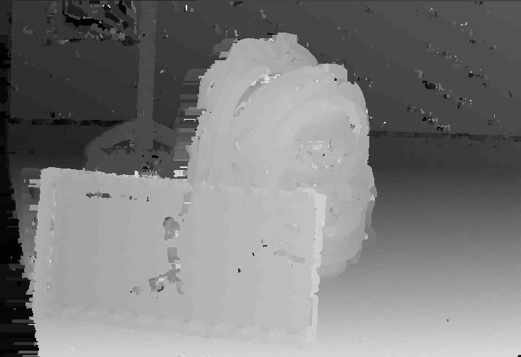

# Phase 5 - Stereo disparity implementation using OpenCL for a GPU

## Summary of goals
A simple but correct parallel implementation of the algorithm running on GPU.

## Host system details
Device info printing is implemented in [`print_device_info()`](../src/device_support.c), which reports the following:
```console
Device info dump:

Device is a GPU
Device vendor: NVIDIA Corporation
Device name: Quadro P600
Device supports dedicated local memory
Device local memory max size is 49152 bytes
Device supports up to 3 compute units with up to 1024 work groups each
Device has maximum clock frequency of 1620 MHz
Device supports constant buffers up to 65536 bytes
Device supports up to 3 work item dimensions
Device work item dimension 0 supports up to 1024 work items
Device work item dimension 1 supports up to 1024 work items
Device work item dimension 2 supports up to 64 work items
Device supports images

end of device info dump
```

## Implementation
Algorithm kernels are implemented in [grayscale.cl](./kernels/grayscale.cl), [resize.cl](./kernels/resize.cl) and [zncc.cl](./kernels/zncc.cl).

Grayscaling and downscaling kernels have been modified from the ones implemented in phase_2 to use the `image2d_t` instead of raw arrays.

[`main.c`](./main.c) contains the host code.

Most of the computation is done within OpenCL code.

Only the "fill zero regions" step of the post-processing is done in host code, as it is bottlenecked by memory accesses and running it on the device is slower than running on the host.

## Output
```console
$ /usr/bin/time -f "\n\nexecution time %e s\npeak memory use %M kB" bin/main
set up OpenCL runtime...
build OpenCL kernels...
Device info dump:

Device is a GPU
Device vendor: NVIDIA Corporation
Device name: Quadro P600
Device supports dedicated local memory
Device local memory max size is 49152 bytes
Device global memory max size is 4234739712 bytes
Device supports up to 3 compute units with up to 1024 work groups each
Device has maximum clock frequency of 1620 MHz
Device supports constant buffers up to 65536 bytes
Device supports up to 3 work item dimensions
Device work item dimension 0 supports up to 1024 work items
Device work item dimension 1 supports up to 1024 work items
Device work item dimension 2 supports up to 64 work items
Device supports images

end of device info dump

loading input images into memory...
downscaling input images...
grayscaling input images...
calculate zncc...
postprocessing disparity data...
filling empty regions (on host)...

OpenCL profiling blocks:
"downscaling" took 1007 µs
"grayscaling" took 505 µs
"zncc_calculation" took 786.737 ms
"postprocessing" took 587 µs

host program profiling blocks:
profiling block "opencl_runtime_setup" took 89.654 ms
profiling block "preprocessing" took 270.180 ms
profiling block "zncc_calculation" took 0.787 s
profiling block "postprocessing" took 62.721 ms
profiling block "total_runtime" took 1.247 s


execution time 1.28 s
peak memory use 221176 k
```

Compared to [phase4](../phase_4/README.md), the performance is a little bit worse.

There is clearly still plenty of room for improvement, especially regarding memory accesses within the OpenCL code.

The computed depthmap looks as expected:




[< Back to top](../README.md)
